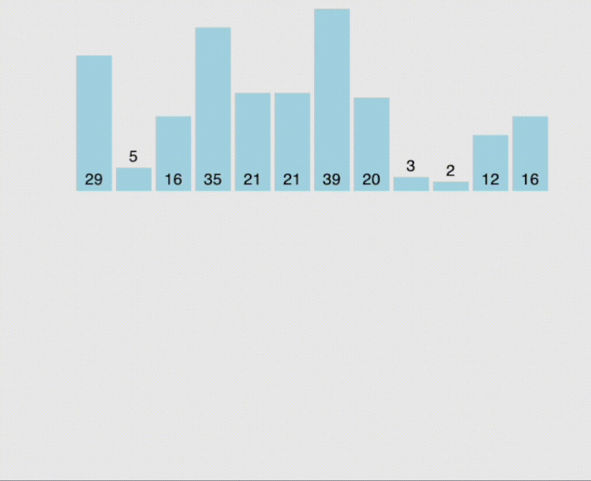

### 상단 - 박예담 / 삽입정렬
담당 : 박예담 

삽입정렬 (Insertion sort)
자료 배열의 모든 요소를 앞에서부터 자례대로 기존 정렬과 비교하여 자신의 위치를 찾아 삽입하는 정렬 

알고리즘 아이디어 
- 숫자의 정렬은 오름차순으로 정리한다
- 삽입 후 이동된 인덱스를 변경한다 

### 중단 - 의사코드

n = insertion_sort 배열의 길이를 변수 n에 할당한다.

    for j in 인덱스 1부터 n-1까지 순회 (두 번째 원소부터 끝까지 '삽입할 원소'로 지정)
        for k in 현재 위치(j)부터 1까지 1씩 감소하며 역순으로 순회 (이미 정렬된 왼쪽 영역을 탐색)
            if insertion_sort[k]가 왼쪽 원소(insertion_sort[k-1])보다 작다면
                insertion_sort[k]와 insertion_sort[k-1]의 위치를 교환하여 한 칸 앞으로 이동
            else (자신보다 작거나 같은 원소를 만났다면)
                올바른 위치를 찾았으므로 inner loop를 중단(break)
 
    정렬된 배열 insertion_sort 반환

### 하단
