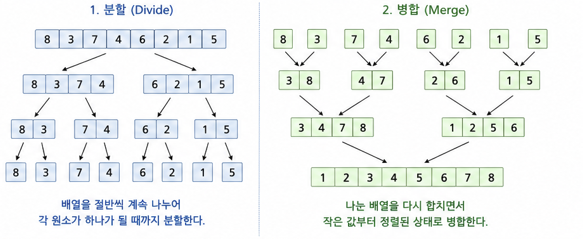

# Merge Sort

## 상단 - 담당자와 설명

**담당 : 고근우**

**병합 정렬(Merge Sort)**을 이용하여 주어진 정수들을 오름차순으로 정렬하는 문제다.

병합 정렬은 주어진 배열을 절반씩 나눈 뒤,  
각 배열을 정렬하면서 다시 합치는 **분할 정복(Divide and Conquer)** 알고리즘이다.

### 시간복잡도

병합 정렬은 배열을 계속 절반으로 나눈다.

```text
8개
↓
4개
↓
2개
↓
1개
```

배열을 절반씩 나누는 과정은 약 `log N`번 발생하고,  
각 단계에서 `N`개의 원소를 비교하면서 병합한다.

```text
N × log N
```

따라서 병합 정렬의 시간복잡도는 **O(N log N)** 이다.

---

### 버블 정렬과 비교

예를 들어 8개의 숫자를 정렬한다고 생각해보자.

버블 정렬은 인접한 두 숫자를 계속 비교하면서 정렬한다.

```text
옆의 숫자를 비교
→ 다시 비교
→ 다시 비교
→ 반복
```

N개의 데이터를 N번 가까이 반복해서 비교하기 때문에

```text
N × N = N²
```

시간복잡도는 **O(N²)** 이다.

| 정렬 알고리즘 | 시간복잡도 |
| --- | --- |
| 버블 정렬 | O(N²) |
| 선택 정렬 | O(N²) |
| 삽입 정렬 | O(N²) |
| **병합 정렬** | **O(N log N)** |

따라서 데이터의 개수 `N`이 커질수록 `O(N²)`인 정렬보다  
`O(N log N)`인 병합 정렬이 더 효율적이다.

병합 정렬은 **최악의 경우에도 O(N log N)** 의 시간복잡도를 보장한다는 장점이 있다.

다만 배열을 합치는 과정에서 새로운 배열을 사용하기 때문에  
**O(N)의 추가 메모리 공간이 필요하다**는 단점이 있다.

### 병합 정렬 과정



---

## 중단 - 의사코드

```text
병합정렬 함수(arr)

    만약 arr의 길이가 1 이하라면
        arr 반환

    mid = arr 길이 // 2

    arr의 처음부터 mid 이전까지를
    병합정렬하여 left에 저장

    arr의 mid부터 끝까지를
    병합정렬하여 right에 저장


    result = 정렬한 값을 저장할 빈 리스트

    왼쪽 인덱스 i를 0으로 초기화
    오른쪽 인덱스 j를 0으로 초기화


    i가 left의 길이보다 작고
    j가 right의 길이보다 작은 동안 반복

        만약 left[i]가 right[j]보다 작다면
            left[i]를 result에 추가
            i를 1 증가시켜 다음 위치로 이동

        아니면
            right[j]를 result에 추가
            j를 1 증가시켜 다음 위치로 이동


    left에 아직 사용하지 않은 값이 남아 있다면
        left의 i번째 위치부터 마지막까지
        result 뒤에 추가

    right에 아직 사용하지 않은 값이 남아 있다면
        right의 j번째 위치부터 마지막까지
        result 뒤에 추가


    정렬이 완료된 result 반환

병합정렬 함수 끝
```

---

## 하단 - 입출력 예시

### Input

```text
5 3 8 4 2 7 1 6
```

### Output

```text
1 2 3 4 5 6 7 8
```