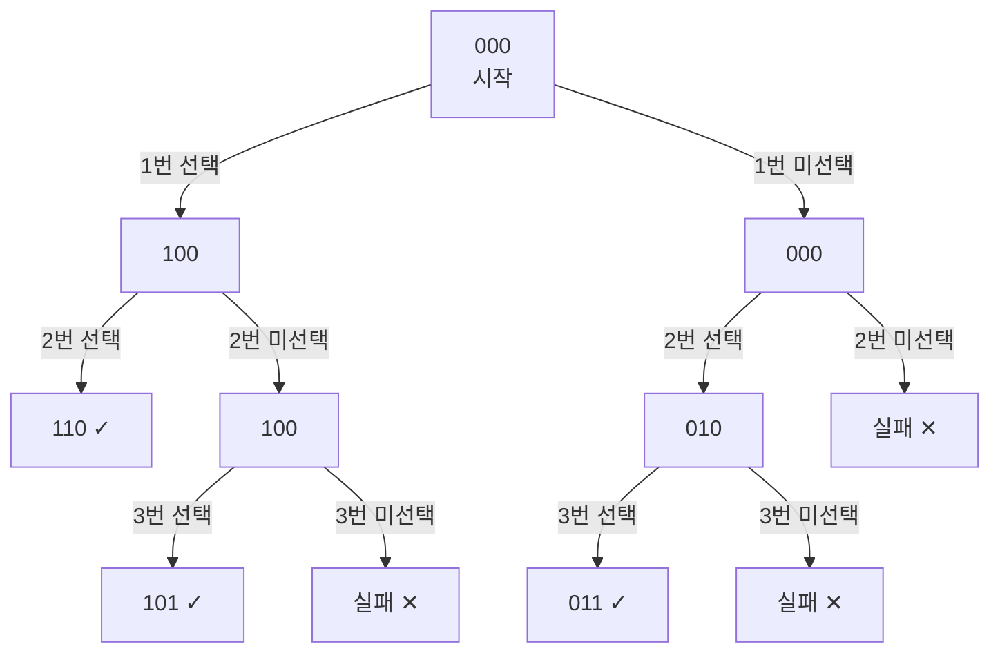

### 상단 - 담당자와 설명
담당 : 박은하

백트래킹이란?


북두신권의 계승자 고근우는 박예담을 마사지해주려고 한다.
마사지는 몸의 비공 N자리 중 M개를 찔러 완료된다.<br>
***실수로 처음 혈과 마지막 혈을 같이 찌르면 박예담은 폭발한다.***<br>
안전하게 마사지를 끝마치기 위해서 누를 수 있는 혈자리 조합을 모두 출력하시오.<br>
한 번 찌른 비공은 다시 찌를 수 없다.

찌를 수 있는 총 비공 개수 N과 찔러야 하는 총 비공의 개수 M이 공백을 사이에 두고 입력된다.
N과 M은 자연수이며, 항상 N > M이다. (N, M <= 10)

찔린 비공은 1, 찔리지 않은 비공은 0으로 바꿔서 가능한 조합을 내림차순으로 모두 출력한다.

#### 예시
```
입력
5 2

출력 
11000
10100
10010
01100
01010
01001
00110
00101
00011
```

### 중단 - 의사코드


``` code

global 
  전역 배열(박예담의 비공)

메인 함수
  총 비공 개수 N 입력 <- 전역 배열 크기
  찌를 비공 개수 M 입력
  백트래킹(0, M) 호출
끝


함수 백트래킹(시작, 남은 찌르기)
  
  if 남은 찌르기 == 0 <- 잘 찔렀는가? 판정
    if 처음, 끝이 모두 1
      함수 끝 <- 박예담 폭발
    비공(전역배열) 출력
    함수 끝
  
  for i번째 비공 in 박예담의 비공
    i번째 비공을 찌른다.
    백트래킹(i + 1, 남은 찌르기 - 1)
    i번째 비공을 해제한다.
백트래킹 끝
```

### 하단
input_01.txt는 간단히 비교할 수 있는 예시가 들어온다
input_02.txt는 가장 많은 경우의 수가 들어온다.
main.exe 파일을 실행하고 N, M을 입력하면 정답이 출력되어 비교할 수 있다.