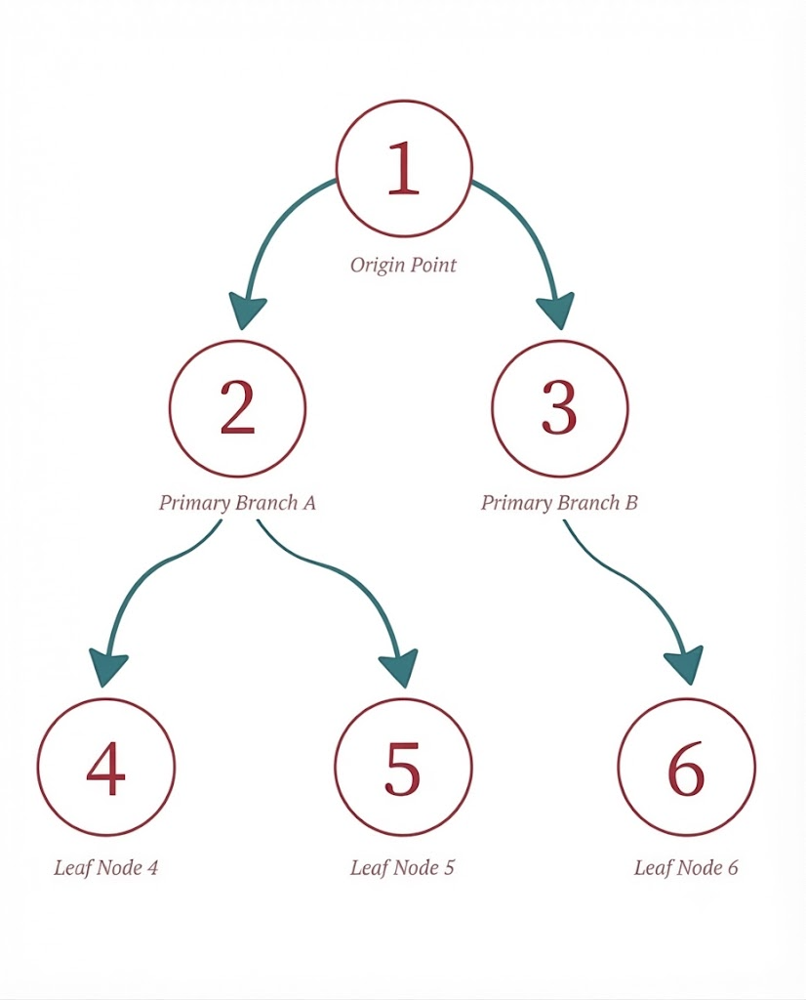

### 상단 - 박예담 DFS 
담당 : 박예담

[ 깊이 우선 탐색 : DFS ]
그래프나 트리에서 한 경로를 더 갈 곳이 없을 때까지 탐색한 뒤, 더 갈 곳이 없으면 이전 정점으로 돌아와 탐색하는 알고리즘 

[용어 설명]
노드(정점) : 데이터가 저장되는 지점 
엣지(간선) : 노드와 노드 사이를 연결하는 선 

[ 예시문제에 대한 배경 지식 ]
g = { 1 : [2,3], 2:[4,5], 3:[6] }

- 방문 여부 배열 : 방문하지 않은 노드는 False / 방문한 노드는 True로 표현 

### 중단 - 의사코드
n, m = map(int, input().split())
G = defaultdict(list)

for _ in range(m):
    u, v = map(int, input().split())
    G[u].append(v)
 
--- 

함수 dfs(시작노드) : 
  방문기록 = []
  방문여부배열 = [ False]가 (n+1)개인 리스트 

  stack = 생성하기 ( deque 사용 )
  stack에 start 노드 추가하기 

  while stack :
    현재 노드 = stack.하나꺼냄() // 가장 최근에 넣은 노드 

    if ( 현재 노드를 아직 방문하지 않았다면 ? ) : 
      현재노드 방문여부 =  True 
      방문순서리스트에 기록 

      // 연결된 이웃 노드를 스택에 담기 
      for (현재 노드의 역순으로 확인) : 
        if 이웃 노드 방문 안했으면 ? 
          stack.추가()

  return 방문기록 
--- 

### 하단

