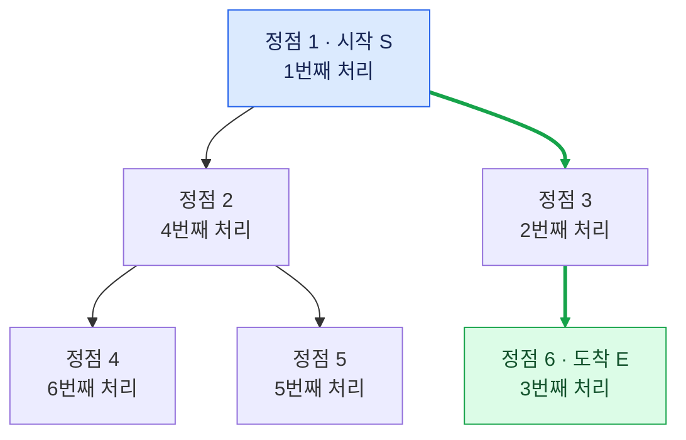
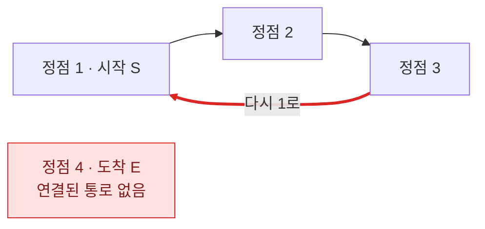

# DFS — 시작점에서 도착점까지 갈 수 있을까?

## 상단 - 담당자와 설명

**담당 : 박은하**

### DFS란?

DFS(Depth-First Search)는 **한 경로를 깊게 탐색하고, 더 갈 곳이 없으면 남겨 둔 갈림길을 탐색하는 알고리즘**이다. 다음에 탐색할 정점을 [스택](../../05_data_structure/02_Stack/pseudocode.md)에 저장한다.

스택은 **가장 나중에 넣은 것을 먼저 꺼내는 후입선출(LIFO)** 구조다. 현재 정점의 이웃을 넣으면, 이전에 남겨 둔 후보보다 그 이웃을 먼저 꺼내므로 한 경로를 깊게 탐색하게 된다.

이 문제에서는 시작점에서 이동할 수 있는 정점들을 탐색한 뒤, **도착점의 방문 여부가 '방문'이면 가능, '미방문'이면 불가능**으로 판단한다.

- **정점(노드)**: 탐색할 대상. 이 문제에서는 번호가 붙은 방이다.
- **간선(엣지)**: 정점 사이의 연결. 이 문제에서는 한 방향으로만 이동하는 통로다.
- **인접 리스트**: 각 정점에서 바로 이동할 수 있는 정점들을 저장한 목록이다.
- **방문 여부 배열(visited)**: 시작점에서 발견하여 스택에 넣은 정점을 기록한다. 이미 표시된 정점은 다시 넣지 않는다.

### 그림으로 보는 DFS

아래 그래프에서 시작점 S는 1, 도착점 E는 6이다. 화살표는 실제로 이동할 수 있는 단방향 간선이다. 탐색 과정을 설명하기 위해 각 정점을 **스택에서 꺼내 처리한 순서**도 표시했다.


```mermaid
flowchart TD
    n1["정점 1 · 시작 S<br/>1번째 처리"] --> n2["정점 2<br/>4번째 처리"]
    n1 --> n3["정점 3<br/>2번째 처리"]
    n2 --> n4["정점 4<br/>6번째 처리"]
    n2 --> n5["정점 5<br/>5번째 처리"]
    n3 --> n6["정점 6 · 도착 E<br/>3번째 처리"]

    classDef start fill:#dbeafe,stroke:#2563eb,color:#172554
    classDef goal fill:#dcfce7,stroke:#16a34a,color:#14532d
    class n1 start
    class n6 goal
    linkStyle 1,4 stroke:#16a34a,stroke-width:3px
```

이웃은 **간선이 입력된 순서대로** 스택에 넣는다. 1에서 이웃 2, 3을 넣으면 마지막에 넣은 3이 먼저 나온다. 3에서 6을 발견하므로 `visited[6]`에 방문 표시가 남는다. **1 → 3 → 6으로 이동할 수 있으므로 답은 '가능'**이다.


### 스택과 visited의 변화

아래 스택은 **오른쪽이 맨 위**, 즉 다음에 꺼낼 위치다. 각 행은 현재 정점을 꺼내고 아직 방문하지 않은 이웃을 넣은 직후다. 방문 표시된 정점은 보기 쉽게 번호순으로 적었다.

| 현재 처리 | 스택 | 방문 표시된 정점 |
| --- | --- | --- |
| 시작 전 | `[1]` | 1 |
| 1 | `[2, 3]` | 1, 2, 3 |
| 3 | `[2, 6]` | 1, 2, 3, 6 |
| 6 | `[2]` | 1, 2, 3, 6 |
| 2 | `[4, 5]` | 1, 2, 3, 4, 5, 6 |
| 5 | `[4]` | 1, 2, 3, 4, 5, 6 |
| 4 | `[]` | 1, 2, 3, 4, 5, 6 |

방문 표시는 **스택에 넣을 때** 남긴다. 따라서 아직 꺼내지 않은 정점도 방문 표시가 되어 있을 수 있다. 시작점에서 연결된 경로를 통해 발견한 정점이므로 도달할 수 있다고 판단할 수 있다.

### 순환 그래프에서 visited가 필요한 이유

간선을 따라가다가 이전 정점으로 돌아오는 **순환(사이클)**이 생길 수 있다. 아래 그래프에서는 1 → 2 → 3 → 1이 반복되며, 도착점 4로 이어지는 통로는 없다.


```mermaid
flowchart LR
    c1["정점 1 · 시작 S"] --> c2["정점 2"]
    c2 --> c3["정점 3"]
    c3 -->|다시 1로| c1
    c4["정점 4 · 도착 E<br/>연결된 통로 없음"]
    classDef unreachable fill:#fee2e2,stroke:#dc2626,color:#7f1d1d
    class c4 unreachable
    linkStyle 2 stroke:#dc2626,stroke-width:3px
```

**방문 여부를 기록하고 확인하지 않으면**, 꺼낸 정점의 이웃을 계속 스택에 넣는다. 아래는 각 정점을 꺼내기 직전의 스택 상태다.

```text
스택: [1] → [2] → [3] → [1] → [2] → [3] → …
처리:  1     2     3     1     2     3    …
```

스택이 비지 않아 탐색이 끝나지 않고, 도착점 4에 갈 수 없다는 판단도 내리지 못한다.

`visited`를 사용하면 **시작점 1을 스택에 넣을 때부터 방문 표시**를 남긴다. 3에서 이웃 1을 확인했을 때 이미 방문 표시가 있으므로 다시 넣지 않는다. 스택이 비면 탐색이 끝나고, `visited[4]`가 미방문이므로 '불가능'을 출력한다.

순환이 없어도 여러 경로가 같은 정점으로 이어질 수 있다. 방문 표시를 통해 같은 정점이 스택에 중복으로 들어가고 반복해서 탐색되는 것을 막는다.

### 문제: 시작 방에서 도착 방까지 이동하기

1번부터 N번까지의 방과 M개의 **단방향 통로**가 주어진다. **시작 방 S에서 도착 방 E까지 이동할 수 있는지** 스택을 이용한 DFS로 판단하시오.

1. 통로 `u v`는 u에서 v로만 이동할 수 있다는 뜻이다. 반대 방향 이동은 별도의 통로가 있어야 한다.
2. 통로를 여러 번 이어서 이동해도 된다.
3. **S와 E가 같으면 이동하지 않아도 이미 도착한 것이므로 '가능'**이다.
4. 시작점에서 도달할 수 있는 정점들을 탐색하고, 도착점의 방문 여부로 결과를 판단한다.

#### Input

- 첫째 줄: 테스트 케이스 개수 T (`T ≥ 1`).
- 각 케이스의 첫째 줄: 정점 수 N과 간선 수 M.
- 다음 M줄: 통로의 출발점 u와 도착점 v.
- **그다음 한 줄: 시작 정점 S와 도착 정점 E.** 간선이 없어도 이 줄은 입력된다.
- `1 ≤ N ≤ 100,000`, `0 ≤ M ≤ 200,000`, `1 ≤ u, v, S, E ≤ N`.
- 자기 자신으로 향하는 통로와 중복 통로가 입력될 수 있다. 중복 통로도 M에 포함한다.
- 테스트가 바뀔 때 그래프와 방문 여부를 새로 준비한다.

#### Output

각 케이스에서 S에서 E로 이동할 수 있으면 **`가능`**, 이동할 수 없으면 **`불가능`**을 한 줄에 출력한다. 출력은 총 T줄이며, 케이스 번호나 탐색 순서는 붙이지 않는다.

#### 예제

입력:

```text
2
6 5
1 2
1 3
2 4
2 5
3 6
1 6 # 2번째 테스트 케이스 시작
4 3
1 2
2 3
3 1
1 4
```

출력:

```text
가능
불가능
```

첫 번째 케이스는 1 → 3 → 6으로 이동할 수 있다. 두 번째 케이스는 1, 2, 3 사이에서만 이동할 수 있으므로 4에 도달할 수 없다.

## 중단 - 의사코드

### 스택으로 도달 가능 여부 확인하기

**한 테스트케이스의 인접 리스트와 시작점 S, 도착점 E가 준비되어 있다고 가정한다.** 이웃 번호는 모두 1부터 N까지의 유효한 정점이며, 이웃을 확인하는 순서는 입력 순서를 따른다.

```text
함수 DFS(이웃 목록, 시작 정점)
    정점 개수만큼의 visted 를 '미방문' 상태로 설정
    빈 스택을 만들고 시작 정점을 넣는다. visited에서 '방문'으로 변경한다.

    while(스택에 내용물이 있는 동안)
        현재 위치 <- 스택의 맨 위를 꺼내와서 넣는다.

        다음 위치 <- 현재 위치에 연결된 정점들
        다음 위치의 유효성 검사(맵 안인가? 미방문 상태인가?)
    
        if 유효하다면
            stack에 다음 위치를 push
            다음 위치를 방문했다고 표시

함수 메인
    시작 장소와 도착 장소 입력
    DFS(시작 장소)
    만약 visited(도착 장소)가 방문이라면 도달 가능하다.
```

### 구현에서 기억할 점

- **시작점도 스택에 넣을 때 방문 표시한다.** 시작점으로 되돌아오는 순환을 막고, S와 E가 같은 경우도 처리할 수 있다.
- **이웃은 미방문인 경우에만 넣고 즉시 방문 표시한다.** 각 정점이 스택에 한 번만 들어가게 된다.
- **탐색 후 도착점의 방문 여부를 확인한다.** 한 정점에서 더 갈 곳이 없어도 스택에 다른 후보가 남아 있을 수 있으므로, 그 순간 '불가능'으로 결론 내리지 않는다.
- 이 문제의 정답은 도달 가능 여부다. 이웃을 정렬할 필요가 없으며, 확인 순서가 바뀌어도 최종 방문 여부와 정답은 같다.

### 복잡도

N은 정점 수, M은 간선 수다.

- **시간: O(N + M).** 방문 배열을 준비하고, 도달한 정점을 한 번씩 꺼내며 그 정점의 간선을 확인한다.
- **추가 공간: O(N).** 방문 배열과 스택에 필요하다. 스택에 넣을 때 방문 표시하므로 중복 후보가 쌓이지 않는다.
- 그래프 저장 공간까지 포함하면 **O(N + M)**이다.

## 하단 - 테스트 케이스 설명

`tests/input.txt` 하나에 아래 **11개 케이스**가 순서대로 들어 있으며, 첫째 줄은 `11`이다. 한 번 실행한 결과를 `tests/output.txt`와 비교한다. 출력 파일의 i번째 줄은 i번째 케이스의 정답이다.

| 케이스 | S → E | 확인하려는 요소 | 예상 출력 |
| --- | --- | --- | --- |
| 1 | 1 → 6 | 여러 통로를 거쳐 도착점에 도달 | `가능` |
| 2 | 1 → 1 | 정점 하나, 간선 없음, 시작점과 도착점이 같음 | `가능` |
| 3 | 3 → 2 | 시작점이 1이 아니며 순환 안에서 도달 | `가능` |
| 4 | 1 → 5 | 시작점과 도착점이 서로 연결되지 않은 부분에 있음 | `불가능` |
| 5 | 2 → 5 | 첫 번째로 꺼낸 정점이 막다른 길이어도 남은 후보를 탐색 | `가능` |
| 6 | 1 → 4 | 여러 경로에서 같은 정점을 만나도 정상 탐색 | `가능` |
| 7 | 1 → 4 | 자기 루프·중복 통로·순환이 있어도 종료 | `가능` |
| 8 | 1 → 3 | 시작점으로 들어오는 통로를 거꾸로 따라갈 수 없음 | `불가능` |
| 9 | 5 → 4 | 같은 그래프에 있어도 통로 방향 때문에 도달하지 못함 | `불가능` |
| 10 | 1 → 4 | 순환을 모두 탐색한 뒤 도착점이 미방문임을 판단 | `불가능` |
| 11 | 2 → 3 | 간선이 없고 시작점과 도착점이 다름 | `불가능` |
